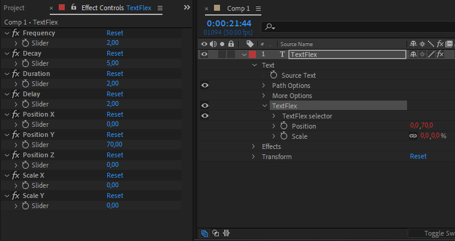
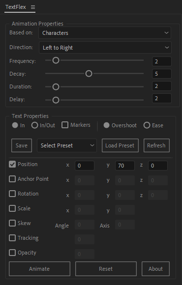
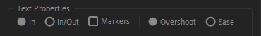
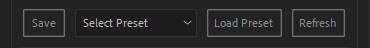
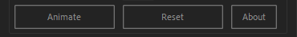
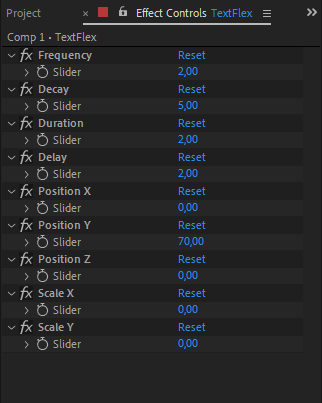

# TextFlex Documentation

## Introduction


### What is TextFlex ?

TextFlex is a script created by Lotfi Jilal. 

This powerful text animation tool for After Effects is designed to break down text animations 
by Characters, words, or lines, offering precise control and flexibility without the need to keyframe.

### What you can do with TextFlex ?

With TextFlex, you can:

- Choose between Overshoot and Ease animation styles.
- Control animation properties like duration and delay.
- Control Direction properties like Right to left or Center Outwords,and more.
- Customize all text properties, including position, scale, and more.
- Add markers to synchronize animations with voiceovers.
- Seamlessly create In and Out animations for dynamic effects and transition.
- You can apply and edit text animations across multiple layers effortlessly.

TextFlex automatically adds a text animation group with selected properties and a sliders control effect:



## Installation

### Settings

Compatibility : After effects CC 2015 +

Go through Edit -> Preferences -> General. A window will open with a bunch of checkboxes, 
where you can enable “Allow Scripts to Write Files and Access Network”.

Copy "texflex.jsx" to ScriptUI Panels folder:

Windows:
``` 
C:/Program Files/Adobe/Adobe After Effects CC/Support Files/Scripts/ScriptUI Panels/ 
```

Mac OS:
``` 
/Applications/Adobe After Effects CC/Scripts/ScriptUI Panels  
```

Then restart After Effects.

## Interface



TexFlex features a user-friendly, dockable interface designed for seamless integration into your After Effects workspace.
You can position the panel vertically or horizontally, aligning it with your workflow preferences.

The panel is organized into intuitive sections, making it easy to access animation controls, sliders, 
and dropdown menus. Whether you’re working on simple animations or complex sequences, 
TexFlex’s interface ensures all tools are at your fingertips, saving time and enhancing productivity.


### Based on
This dropdown menu determines the unit of animation. Choose whether the text animates 
based on Characters, Words, or Lines, allowing for precise control over how the animation is applied to the text.

### Direction
This dropdown menu controls the flow of the animation. Select from:

- Left to Right: Animates sequentially from left to right.
- Right to Left: Animates sequentially from right to left.
- Center Inward: Animates starting from the edges toward the center.
- Center Outward: Animates starting from the center outward.
- Random: Animates elements in a random sequence.


### Text Properties



The Text Properties Section in TexFlex provides robust controls to customize your text animation. 
Below is an overview of the available features:

#### In :
This option, selected by default, ensures the animation starts at the beginning of the text layer. 
It's a straightforward way to apply animations without additional configuration.

#### In/Out :
Selecting this option enables both "In" and "Out" animations. 
The "Out" animation is automatically applied at the end of the text layer, 
allowing seamless entry and exit animations for your text.

#### Markers :
By checking this box, you can add markers to your text layer. 
These markers allow you to synchronize animations with voiceovers or customize timing according to your specific preferences.

#### Overshoot : 
This option provides dynamic, bounce-like animation effects, giving your text a lively and energetic feel.

#### Ease : 
This option applies a simple, smooth ease-in and ease-out animation style, perfect for subtle and polished effects.

### Preset Section



The Preset Section of TexFlex provides intuitive tools to save, load, and manage your custom animation presets. 
Here’s a breakdown of its functionality:

#### Save Button:
Use this button to save your current animation settings as a preset. To save a preset, 
ensure you have a text layer with TexFlex animations or animators applied. 
The parameters and values of the selected text layer will be saved for future use.

#### Select Preset Dropdown Menu:
This menu allows you to view and select from your saved presets. 
Simply choose the desired preset from the dropdown list to prepare it for loading or editing.

#### Load Preset Button:
Once a preset is selected from the dropdown menu, pressing this button applies the preset's settings to the currently selected text layer. 
This makes it easy to reuse your favorite animation configurations.

#### Refresh Button:
If you open After Effects and don’t see your saved presets or if you’ve added new presets externally, 
use this button to refresh the dropdown menu. It ensures that all available presets are loaded and ready for use.

### Animation Buttons



#### Animate Button:
After selecting your preferred animation style and text properties, click the Animate button to generate control sliders and apply the text animation. 
This makes customization straightforward and quick.

#### Reset Button:
When you've generated your animation using the Animate button, you can manually refine the values directly in the TexFlex UI panel.
Once adjustments are made, click the Reset button to instantly apply your changes and update the animation. 
This feature ensures precision and supports an efficient workflow.

## Controls



### Frequency
This parameter defines the oscillation speed of the animation when using the "Overshoot" style. 
Higher values create rapid bounces, while lower values result in smoother, slower movements.

### Decay
This parameter controls how quickly the overshoot effect diminishes over time. 
Use a higher decay to reduce the bouncing effect faster, or a lower decay for a prolonged and dramatic overshoot.

### Duration
This parameter controls the length of time the text animation takes to complete. 
Adjust it to make your animation faster or slower based on your project's needs.

### Delay
This parameter sets the delay between the animations of individual characters, words, or lines. 
Increase the value for a staggered effect, or decrease it for a more synchronized look.


### Text Properties

TexFlex offers versatile control over your text animation properties, including Position, Rotation, Scale, and more. You can manage these properties in two ways:

- 1 -Slider Controls: Adjust the values using intuitive sliders to fine-tune the animation effortlessly.
- 2 -UI Panel Input: Manually enter precise values directly in the Textflex UI panel for exact control, once you've made your adjustments, 
click the Reset button to apply your changes and instantly update the animation, ensuring a seamless and efficient workflow.


## FAQ

### Why is the "Based On" function not included in the effect?

The "Based On" option cannot be controlled by expressions, which is why it is available only in the script panel.

### Why can't I save the Direction property and the text properties: In/Out, Markers, Overshoot, and Ease?

Currently, you can only save the "Based On" property and key text animation properties such as position, scale, rotation, and more. 
For other properties like Direction, In/Out, Markers, Overshoot, and Ease, you will need to manually chose them before clicking the "Load Preset" button.